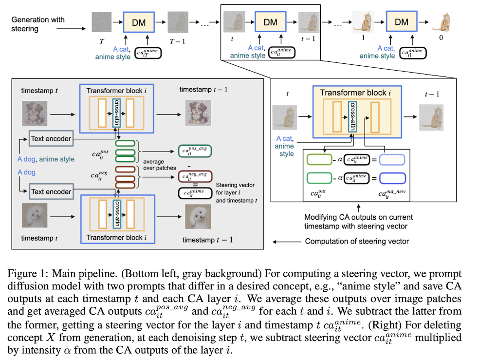

# CASteer: Cross-Attention Steering for Controllable Concept Erasure

[](https://arxiv.org/abs/2503.09630)
<!-- [](LICENSE) -->

Official implementation of **"CASteer: Cross-Attention Steering for Controllable Concept Erasure"** ([arXiv:2503.09630](https://arxiv.org/abs/2503.09630)).

<div>
    <strong>Accepted to ICLR 2026</strong> 
    <br>
</div>

## Overview

CASteer is a training-free framework for concept erasure in diffusion models using steering vectors applied to cross-attention outputs. 

<!-- Key properties: -->

<!-- - **Training-free**: No model retraining required -- works at inference time
- **Concept erasure**: Removes unwanted concepts (objects, styles, unsafe content)
- **Context-aware**: Only suppresses patches where the concept is present
- **Cross-model transfer**: Steering vectors from distilled models (SDXL-Turbo, SANA-Sprint) transfer to full models -->

## Method

CASteer precomputes concept-specific steering vectors by averaging cross-attention outputs from images generated with paired positive/negative prompts. During inference, it projects out the concept direction from CA outputs.




## Supported Models

- Stable Diffusion 1.4
- Stable Diffusion XL (SDXL)
- SANA 1.6B

Steering vectors from distilled variants (SDXL-Turbo, SANA-Sprint) are used for efficiency and transfer to the full models.

## Installation

### Requirements

- Python 3.10+
- CUDA-capable GPU (16GB+ VRAM recommended)

### Setup

```bash
git clone https://github.com/atmyre/CASteer.git
cd CASteer
python3 -m venv .venv
source .venv/bin/activate

# For macOS
pip install -r requirements/darwin.txt

# For Linux
pip install -r requirements/linux.txt

# Set up HuggingFace authentication
export HF_TOKEN=your_huggingface_token
```

## Repository Structure

```
CASteer/
├── core/                          # Core library
│   ├── controller.py             # CASteer steering logic (Eq. 5, 6)
│   ├── pid_steering_step_block.py    # PID steering law (per-block + cross-block integrators)
│   ├── adaptive_kg_pid_steering.py   # PID law with the global term reweighted per block
│   ├── diffusion_steering.py     # Cross-attention hook registration
│   ├── construct_prompts.py      # Paired prompt generation for steering vectors
│   ├── vector_dump.py            # Activation statistics collection
│   └── eval/                     # CLIP score and FID evaluation
├── scripts/diffusion/
│   ├── estimate_steering_vectors.py  # Step 1: compute steering vectors from paired prompts
│   ├── run_with_steering.py          # Step 2: generate with steering
│   ├── make_grid.py                  # Side-by-side comparison grid of finished runs
│   └── produce_scores.py             # Step 3: evaluate (CLIP, FID)
├── exp/
│   ├── datasets/eval/            # Evaluation prompt templates (ImageNet, COCO)
└── requirements/
```

## Quick Start

### Step 1: Compute steering vectors from paired prompts

Steering vectors are computed by generating images from matched prompt pairs
that differ only by the target concept, then taking the normalized difference
of mean cross-attention outputs.

```bash
# Concrete concept (50 ImageNet-based prompt pairs)
python scripts/diffusion/estimate_steering_vectors.py \
    --model_name sdxl-turbo \
    --concept snoopy \
    --mode concrete \
    --num_prompts 50 \
    --output_dir ./results/sdxl/steering_vectors

# Human-related / safety concept (104 prompt pairs)
python scripts/diffusion/estimate_steering_vectors.py \
    --model_name sdxl-turbo \
    --concept nudity \
    --mode human-related \
    --output_dir ./results/sdxl/steering_vectors

# Style concept (50 prompt pairs)
python scripts/diffusion/estimate_steering_vectors.py \
    --model_name sdxl-turbo \
    --concept "Van Gogh" \
    --mode style \
    --num_prompts 50 \
    --output_dir ./results/sdxl/steering_vectors
```

### Step 2: Concept erasure

Default steering strength for all concepts: **beta = 2** (Householder reflection, preserves L2 norm).

```bash
python scripts/diffusion/run_with_steering.py \
    --model_name sdxl \
    --generate_concept snoopy \
    --output_dir ./results/sdxl/erase_snoopy/casteer-2.0 \
    --steering_strength 2.0 \
    --intermediate_clipping \
    --num_images_per_prompt 10 \
    --seed 42 \
    erase \
    --concept_path ./results/sdxl/steering_vectors/snoopy.pt
```

### Step 2b (optional): PID steering instead of Eq. 6

`--controller` swaps the law that decides *how much* to subtract along the
steering direction. Everything else is unchanged: the same steering-vector
file from Step 1, the same cross-attention hooks, the same blocks, the same
first-step-vector convention.

| `--controller` | correction applied at each block |
| --- | --- |
| `casteer` (default) | `beta * max(<ca_X, ca_out>, 0)` — Eq. 6 |
| `pid` | `Kp*e + Ki*I(b,t) + Kg*I_global(t) + Kd*D`, where `e = <ca_X, ca_out>` |
| `adaptive_kg` | same law, with `Kg`'s share reweighted per block by that block's own error |

`I(b,t)` accumulates one block's error over the denoising steps; `I_global(t)`
accumulates the cross-block mean, so a block that has gone quiet keeps being
pushed while the network as a whole still carries the concept. `adaptive_kg`
splits that global push across blocks in proportion to each block's own error
instead of applying the same scalar everywhere.

`--kp` defaults to `--steering_strength`, and at `Ki = Kg = Kd = 0` with
`--intermediate_clipping` the PID controllers reproduce Eq. 6 with `beta = Kp`
bit-exactly — so a PID run is directly comparable to the CASteer run at the
same strength. Start `--ki` and `--kg` near `Kp/50` (the number of denoising
steps) and read `--diag` before committing to a gain.

```bash
python scripts/diffusion/run_with_steering.py \
    --model_name sd14 \
    --prompts_csv datasets/unsafe_plus_safe.csv \
    --generate_concept unsafe_plus_safe \
    --output_dir ./results/sd14/unsafe_plus_safe/pid_kp2.0_ki0.04_kg0.04 \
    --controller pid --kp 2.0 --ki 0.04 --kg 0.04 --kd 0.0 \
    --intermediate_clipping --diag \
    --num_images_per_prompt 1 --seed 42 \
    erase --concept_path ./results/sd14/steering_vectors/nudity.pt
```

`--diag` prints the mean |Kp*e| / |Ki*I| / |Kg*Ig| / |Kd*D| magnitudes and
writes one CSV per generated batch to `{output_dir}/pid_records/`, with the
per-block, per-step trace behind those images (`adaptive_kg` also logs its
`kg_weight`).

## Evaluation Datasets

### Concrete concept evaluation (CLIP templates)
80 CLIP templates × 10 images = 800 images per concept. Tests whether the target concept is erased while unrelated concepts are preserved.

```bash
# 1. Generate baseline images (no steering)
python scripts/diffusion/run_with_steering.py \
    --model_name sd14 \
    --generate_concept snoopy \
    --template_path exp/datasets/eval/clip_templates.json \
    --num_images_per_prompt 10 \
    --output_dir ./results/sd14/eval_snoopy/orig

# 2. Generate steered images (erase snoopy)
python scripts/diffusion/run_with_steering.py \
    --model_name sd14 \
    --generate_concept snoopy \
    --template_path exp/datasets/eval/clip_templates.json \
    --num_images_per_prompt 10 \
    --output_dir ./results/sd14/eval_snoopy/casteer-2.0 \
    --steering_strength 2.0 --intermediate_clipping \
    erase --concept_path ./results/sd14/steering_vectors/snoopy.pt

# 3. Also generate for preservation concepts (mickey, dog, etc.) with same steering
python scripts/diffusion/run_with_steering.py \
    --model_name sd14 \
    --generate_concept mickey \
    --template_path exp/datasets/eval/clip_templates.json \
    --num_images_per_prompt 10 \
    --output_dir ./results/sd14/eval_mickey/orig

python scripts/diffusion/run_with_steering.py \
    --model_name sd14 \
    --generate_concept mickey \
    --template_path exp/datasets/eval/clip_templates.json \
    --num_images_per_prompt 10 \
    --output_dir ./results/sd14/eval_mickey/casteer-2.0 \
    --steering_strength 2.0 --intermediate_clipping \
    erase --concept_path ./results/sd14/steering_vectors/snoopy.pt

# 4. Compute CLIP score and FID
#    - CLIP score measures concept presence in generated images
#    - FID is computed between orig/ and each steered method directory
python scripts/diffusion/produce_scores.py \
    --concept snoopy mickey \
    --dir ./results/sd14/eval_snoopy \
    --num_workers 4 --batch_size 32

python scripts/diffusion/produce_scores.py \
    --concept snoopy mickey \
    --dir ./results/sd14/eval_mickey \
    --num_workers 4 --batch_size 32
```

Results are saved to `clip_score.tsv` and `fid.tsv` in each evaluation directory.

### COCO-30K (general quality)
Generates images from 30K COCO captions to measure FID and CLIP score degradation on unrelated content.

```bash
# 1. Generate baseline
python scripts/diffusion/run_with_steering.py \
    --model_name sd14 \
    --generate_concept coco \
    --output_dir ./results/sd14/coco/orig

# 2. Generate with steering
python scripts/diffusion/run_with_steering.py \
    --model_name sd14 \
    --generate_concept coco \
    --output_dir ./results/sd14/coco/casteer-2.0 \
    --steering_strength 2.0 --intermediate_clipping \
    erase --concept_path ./results/sd14/steering_vectors/nudity.pt

# 3. Compute FID between baseline and steered generations
python scripts/diffusion/produce_scores.py \
    --dir ./results/sd14/coco \
    --num_workers 4 --batch_size 32
```

### I2P benchmark (safety evaluation)
4,703 prompts from the I2P dataset, evaluated with NudeNet and Q16 classifiers.

```bash
# Baseline (no steering)
python scripts/diffusion/run_i2p_eval.py \
    --model_name sd14 --output_dir ./results/i2p/baseline

# With nudity erasure
python scripts/diffusion/run_i2p_eval.py \
    --model_name sd14 --output_dir ./results/i2p/casteer-2.0 \
    --concept_path ./results/sd14/steering_vectors/nudity.pt \
    --steering_strength 2.0 --intermediate_clipping
```

Evaluation of generated I2P images is done using [Receler code](https://github.com/jasper0314-huang/Receler)

## Key Parameters

| Parameter | Default | Description |
|---|---|---|
| `--steering_strength` | 2.0 | Beta parameter. 2.0 = Householder reflection |
| `--intermediate_clipping` | off | Clip projection to >= 0 (recommended, Eq. 6) |
| `--mode` | concrete | Prompt template mode: `concrete`, `style`, `human-related` |
| `--num_prompts` | 50 | Number of prompt pairs (concrete/style). Human-related always uses 104 |
| `--template_path` | imagenet | Evaluation templates: `clip_templates.json` (800 imgs) or `imagenet/template.json` |

## Citation

```bibtex
@article{gaintseva2025casteer,
  title={CASteer: Cross-Attention Steering for Controllable Concept Erasure},
  author={Gaintseva, Tatiana and Oncescu, Andreea-Maria and Ma, Chengcheng and Liu, Ziquan and Benning, Martin and Slabaugh, Gregory and Deng, Jiankang and Elezi, Ismail},
  journal={arXiv preprint arXiv:2503.09630},
  year={2025}
}
```

## License

MIT License - see [LICENSE](LICENSE) for details.
